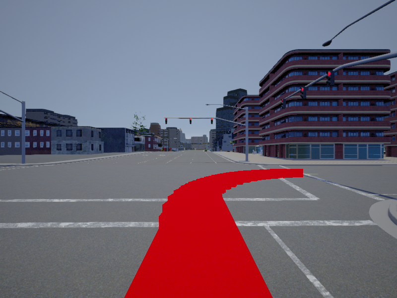

# Generate visual navigation data for CARLA

**[CARLA](https://github.com/carla-simulator/carla) Version: 0.9.5**

**Raw camera image + Instruction + Semantic visual navigation path + Semantic ground truth**

**Raw camera image**

**Instruction**

**Semantic visual navigation path**

**Semantic ground truth**
